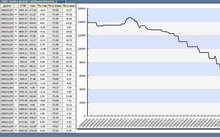

Индивидуальная система учета энергоресурсов

Задача программно-технического комплекса сбор данных о потреблении энергоресурсов зданиями в автоматическом режиме, расчет параметров потребления, визуализация и анализ данных. Программный комплекс на нижнем уровне поддерживает большое количество различных приборов учета.

Система предназначена для сбора и формирования часовых, дневных, месячных значений по входным узлам учета или индивидуальным счетчикам, в зависимости от возможностей оборудования.

Автоматизированный учет и расчет потребления тепловой энергии, горячей и холодной воды, электрической энергии, потребляемых абонентами, посредством измерения количественных, качественных и режимных параметров энергоносителей или проведения вычислений по заложенным, сертифицированным алгоритмам.

Задача программно-технического комплекса сбор данных о потреблении энергоресурсов зданиями в автоматическом режиме, расчет параметров потребления, визуализация и анализ данных. Программный комплекс на нижнем уровне поддерживает большое количество различных приборов учета.

Предоставление единой точки веб-доступа персоналу и пользователям системы (управляющим компаниям, заинтересованным службам районов и городской администрации) ко всей необходимой информации (к данным измерения узлов учета энергоносителей, к данным индивидуального потребления, к расчетным показателям энергообеспечения, отчетам, паспортным данным) с разграничением уровней доступа к информации.

Программный комплекс состоит из сервера и набора контроллеров, каждый из которых отвечает за свое здание. Программный комплекс контроллера состоит из базы данных MySQL, сервера сбора данных, веб-сервера и встроенного конфигуратора.  На верхнем уровне все контроллеры (по одному на здание) объединяются в единую систему с общим веб-интерфейсом доступа.

Конфигурация контроллера происходит с помощью встроенного интерфейса путем добавления устройств, объектов, каналов, датчиков, формирования расчетных схем.  Встроенный веб-интерфейс, также позволяет просматривать показания и считывать отчеты локально по отдельному объекту.
В зависимости от конфигурации подключенных устройств в состав ДК включаются различные драйвера.

Сервис сбора данных, считывает текущие и архивные данные со всех контроллеров (ДК), конфигурации отдельных объектов. Таблицы данных и конфигураций передаются на общий веб-сервер.
Веб-сервер обеспечивает разграниченный доступ пользователей к данным всех систем учета путем отображения интерфейса (табличный вывод и построение диаграмм). 

На нижнем уровне происходит сбор данных с измерительных устройств и преобразователей интерфейсов. Контроллер, в зависимости от конфигурации, собирает данные с сети устройств по интерфейсу RS-485, с сети концентраторов беспроводных устройств по CAN протоколу (а через них с датчиков температуры, расхода и электроэнергии), с сети электросчетчиков, с вводного тепловычислителя, выводит локальную информацию на внешний монитор или на панель оператора.
